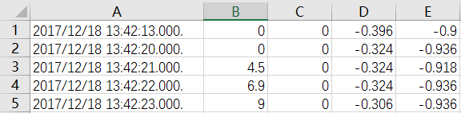
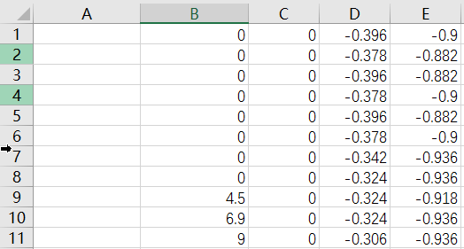
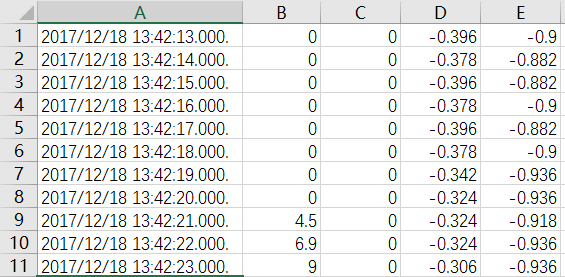

# 代码仓库
构建自己的代码仓库

### python对excel的操作

背景：
```
有两个excel文件：f1.xlsx和f2.xlsx
f1.xlsx文件为：
```


```
f2.xlsx文件为：
```

```
经过操作之后:
f1.xlsx文件不变，f2.xlsx文件内容变为：
```



要点：
```
1. 实现python对xlsx的读写操作，数据量18万

​2. 
```